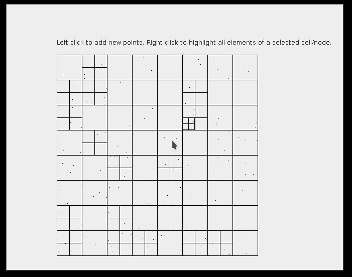
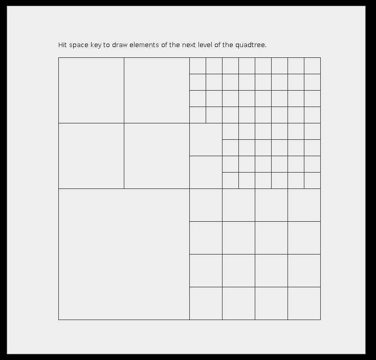

# JavaQuadTree

This project contains two very basic QuadTree implementation for Java.

## Point Quad Tree

The point quad tree allows insertion of elements with provided coordinates. The quad tree will automatically subdivide when the maximum limit per cell has been reached.

```java
// Create the quad tree with a 0,0 start coordinate and a dimension of 600x600
PointQuadTree<String> tree = new PointQuadTreeImpl<>(Point.of(0, 0), Size.of(600, 600));

// Store a bunch of strings with provided coordinates
tree.insert(1, 3, "1");
tree.insert(11, 32, "2");

tree.insert(454, 555, "4");
tree.insert(353, 555, "5");
tree.insert(552, 555, "6");
tree.insert(551, 555, "7");

// Locate the elements for a provided coordinate
Point target = Point.of(500, 550);
Vector<PointNodeElement<String>> elements = tree.getElements(target);
```



## Spatial Quad Tree

The spatial quad tree works a bit different. Here you don't specify the coordinates in which you want to insert the element. Instead the element dimensions will be specified. The quad tree will automatically locate a cell which can store the element with the provided size. The quad tree will automatically be subdivided to generate smaller cells if needed.

NOTE: Please note that the current implementation does only work with element dimensions which are rectangular in shape and which have a size that is dividable by the initial quad tree dimensions. 

```java
SpatialQuadTree<String> tree = new SpatialQuadTreeImpl<>(Point.of(0, 0), Size.of(600, 600));
	boolean inserted = tree.insert(Size.of(150, 150), "2");
```

